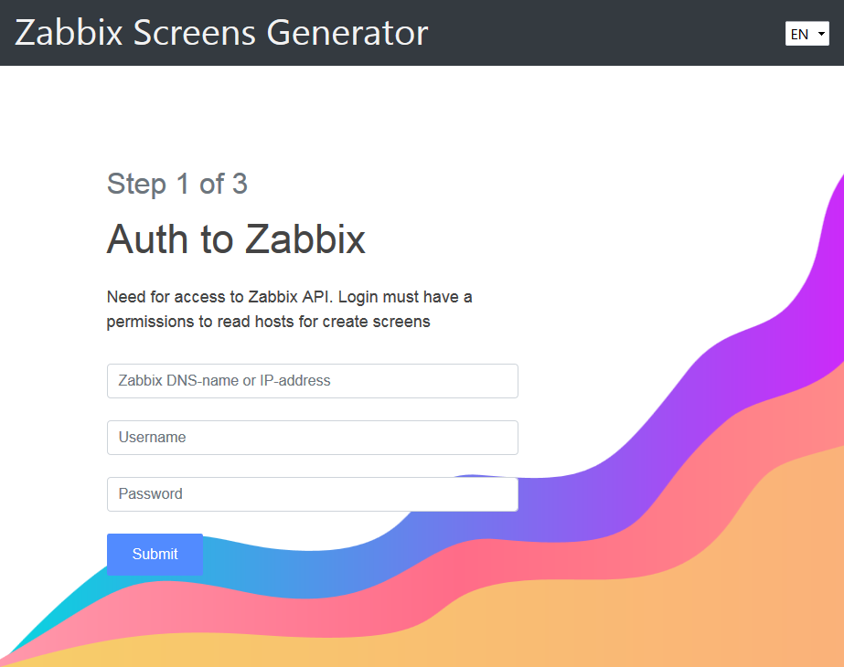
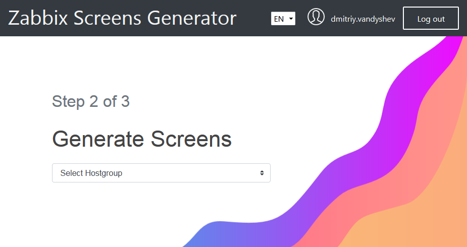
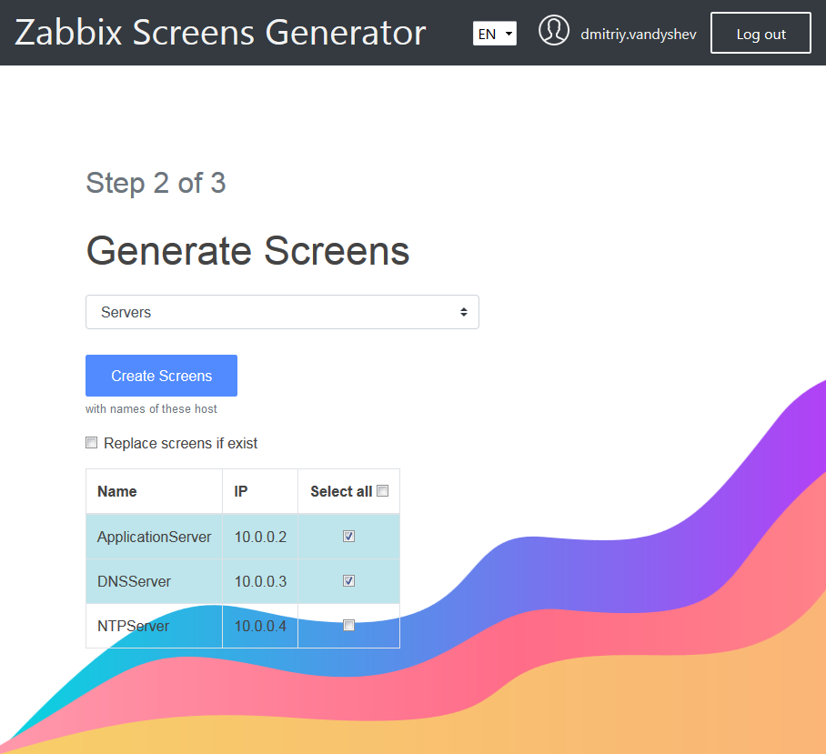
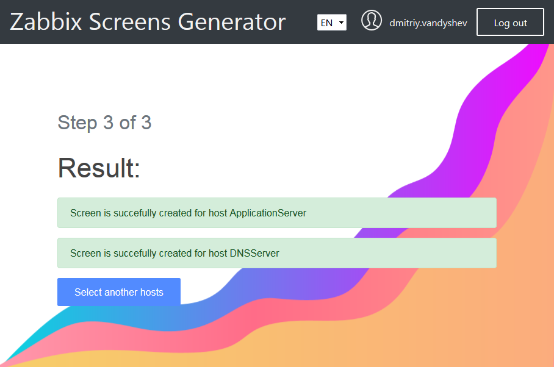

# Zabbix Screens Generator

Web application for creating screens per host with all its graphs

## Table of contents

   * [Technology stack](#technology-stack)
   * [Installation](#installation)
   * [Usage](#usage)
   * [Security](#security)

## Installation
 
Assuming that you have already installed Git, Ruby, NodeJS

1. git clone https://github.com/d-vandyshev/zabbix-screens-generator
1. cd zabbix-screens-generator
1. bundle install
1. rails server

That runs a local webserver. On a local machine, paste the URL http://localhost:3000 into the address bar of your browser.

## Usage

1. Open URL http://localhost:3000 and enter Zabbix credentials

1. Select Host group

1. Select the hosts for which you want to create screens

1. Page with statuses

## Technology stack

| Element       | Tool                  |
| ------------- | --------------------  |
| Web framework | _Ruby on Rails 5.1.4_ |
| Design        | _Froala blocks_       |
| CSS framework | _Bootstrap 4_         |
| Icons         | _SVG evil_icons_      |
| JS Framework  | _Stimulus_            |

## Security

* Place for Zabbix credentials (server, username, password): _not stored_
* Place for Zabbix instance: _save in memory (Rails.cache) of the server for current session_
